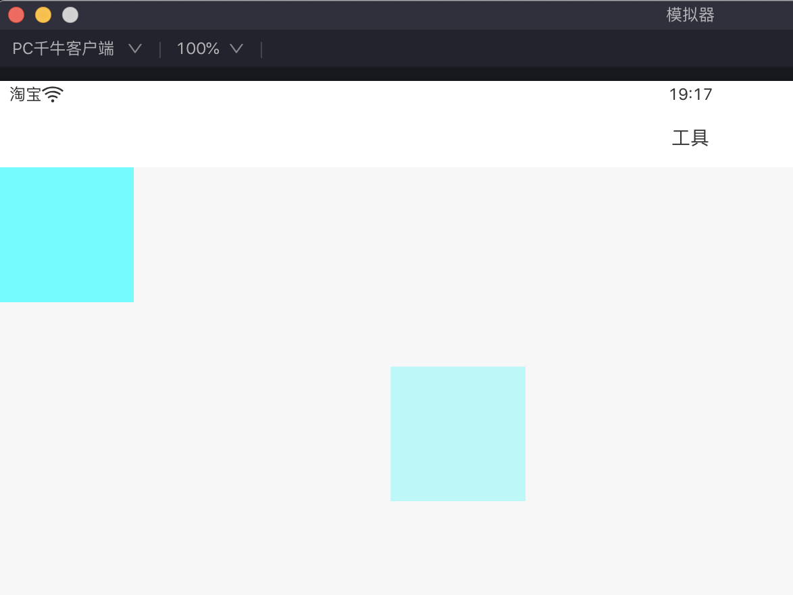
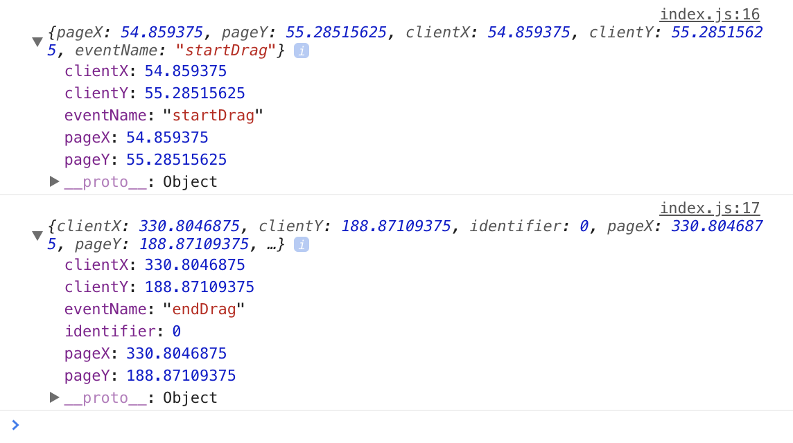

# ali-miniapp-gao
## 1. draggable
page/index.json
```json
{
  "defaultTitle": "",
  "usingComponents": {
     "draggable": "ali-miniapp-gao/draggable/draggable" 
  },
  "pullRefresh": false
}
```
page/index.axml
```xml
<view style="height:100vw;width:100vh;">
  <draggable
    startDrag={{caller}}
    endDrag={{caller}}
    width="100px"
    height="100px"
    styleObj="{{}}"
  >
    <view class="ccc"></view>
  </draggable>
</view>
```
page/index.js
```js
import dragCaller from "ali-miniapp-gao/draggable/dragCaller"
Page({
  data: {
    caller: {}
  },
  onLoad(query) {
    let caller = dragCaller(e => { console.log(e) }, (e) => { console.log(e) });
    this.setData({ caller });
  },
});

```




